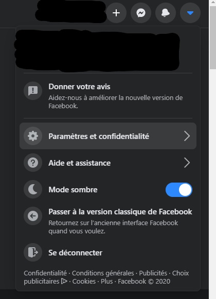
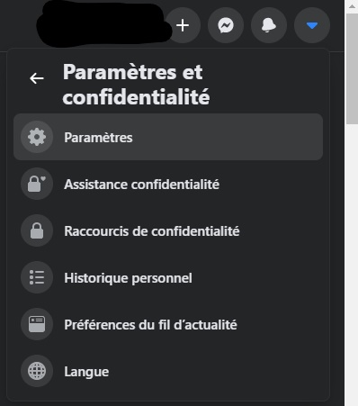
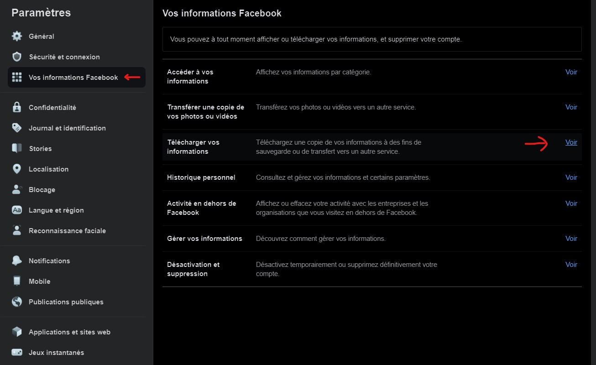
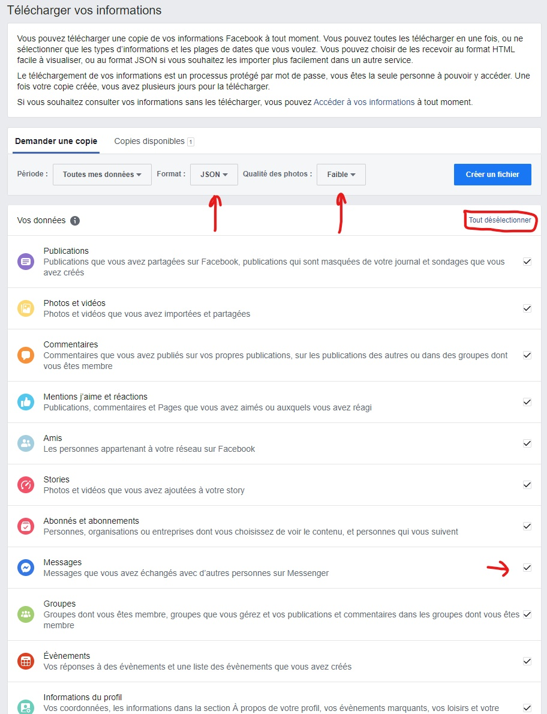

# Messenger-Text-Generation
Generate messages from Messenger chat (Facebook) with Recurrent Neural Network (character by character)

## Download messages from Facebook

Top Right on facebook, go into parameters and privacy

Into parameters

Your facebook datas -> Download your datas

Unselect all, only select messages. Choose JSON format and low quality to get a smaller file.
Create file and wait for Facebook (usually few hours).
## Run the notebook

Before running you can change detect_messenger_sentence in preprocessing.py to replace banned french words by other words.

The model learns output like :  
First_person : ..........  
Second_person : .........  
... : ...  

The algorithm will just learn to write like the people in the chat group.
It can only use characters you already wrote in the chat.
It's just for fun. The output will probably not respect grammar or common sense between sentences.

Acknowledgements :  
https://www.kaggle.com/shahules/basic-eda-cleaning-and-glove#Data-Cleaning  
https://www.tensorflow.org/tutorials/text/text_generation
